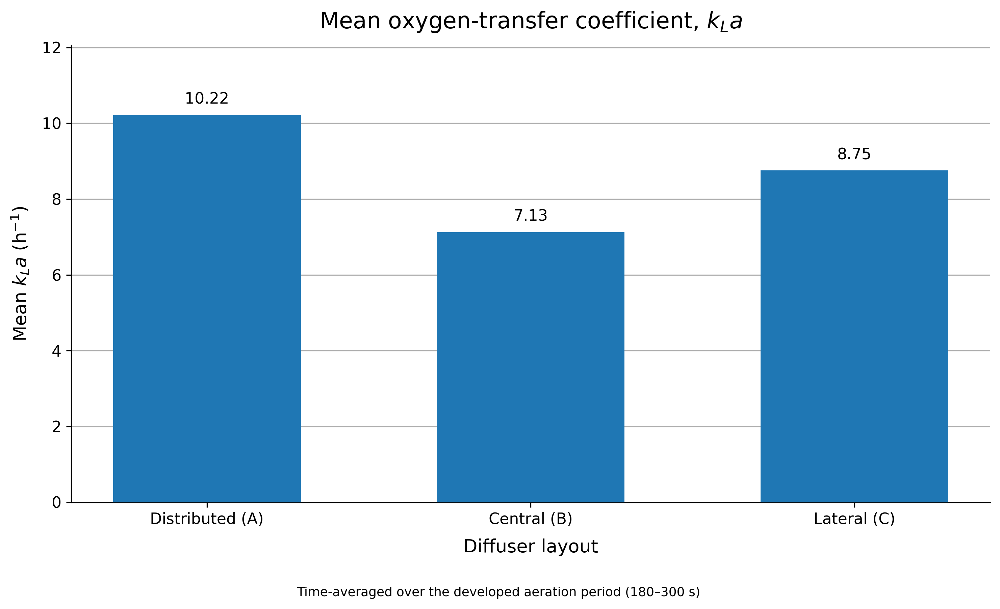
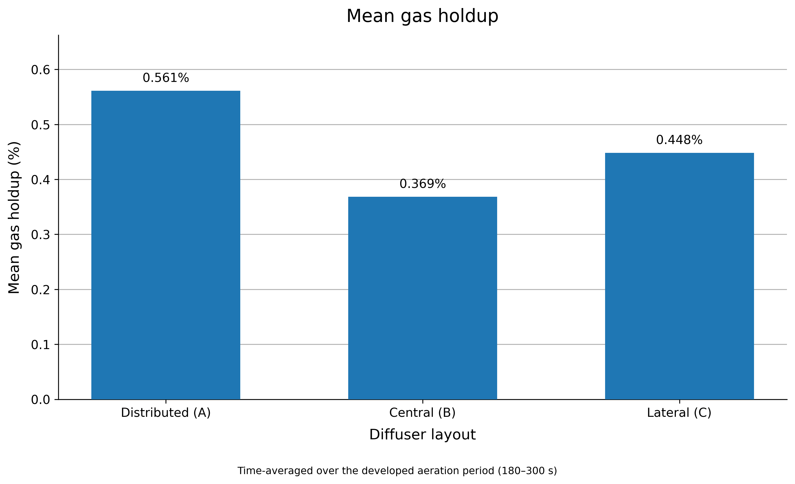
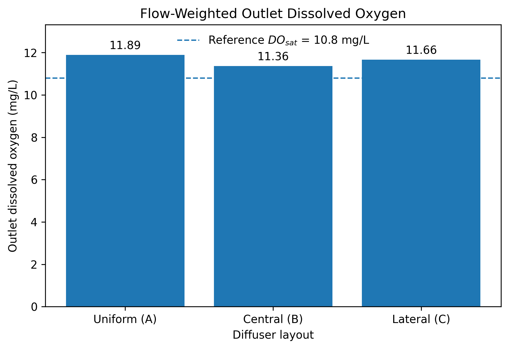
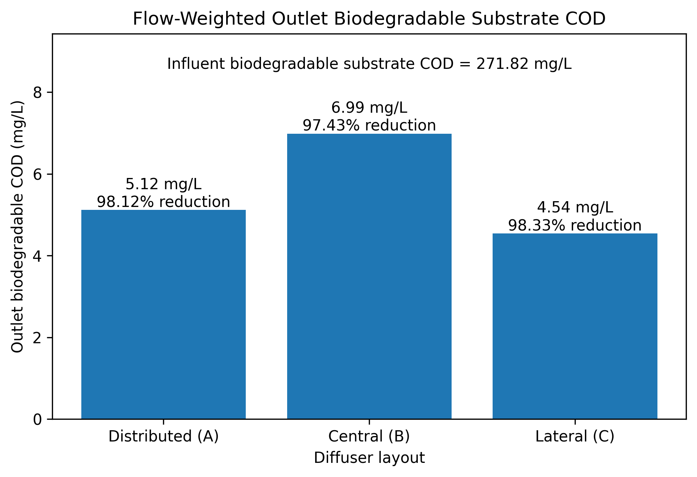
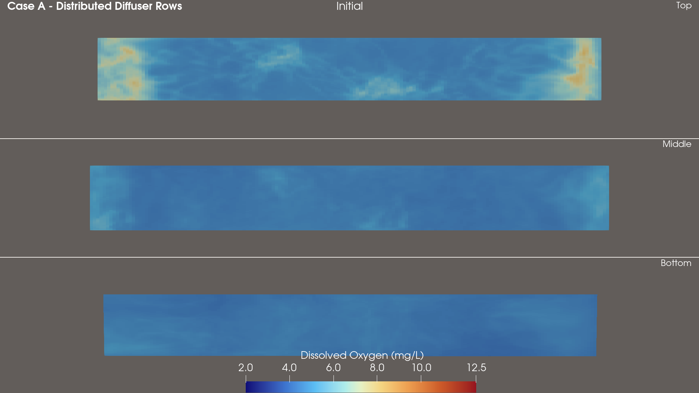
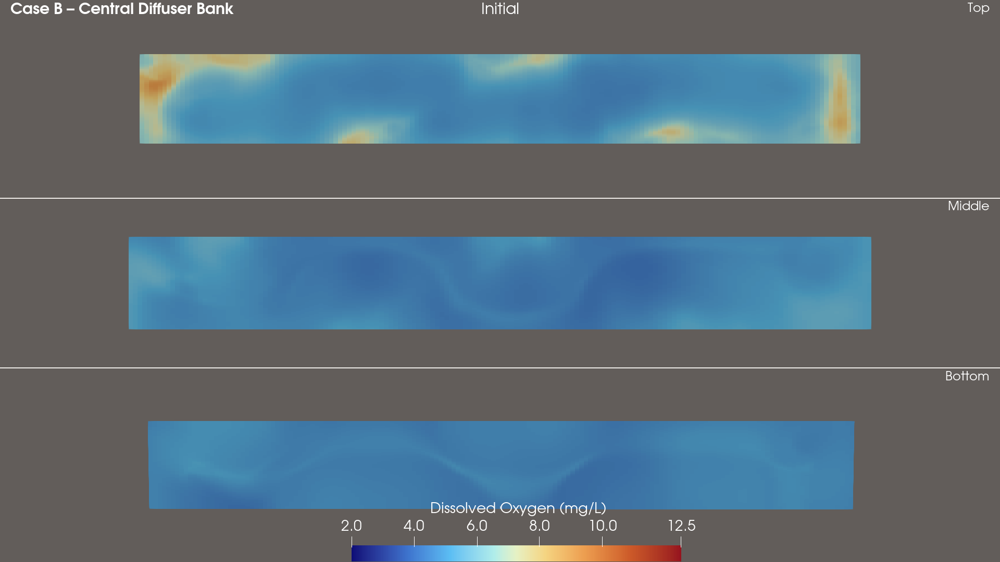
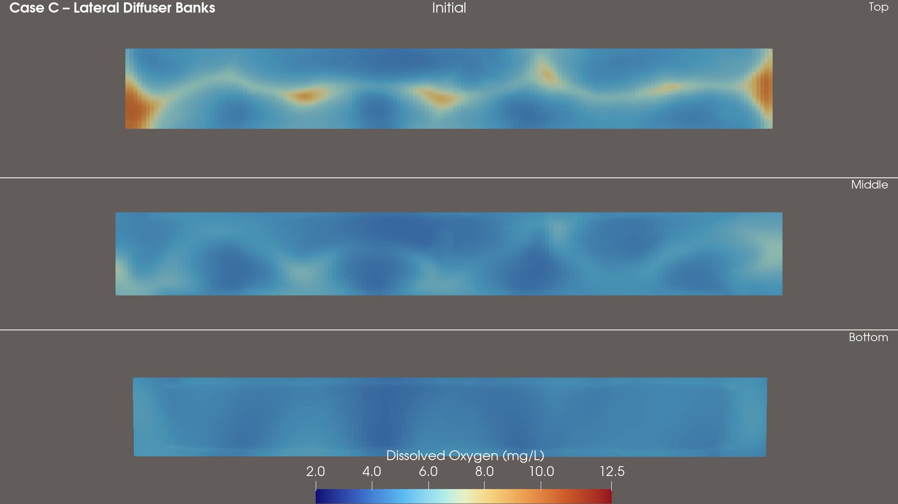

# Wastewater Treatment CFD

OpenFOAM study of aeration-tank hydrodynamics, air–water mixing, oxygen transfer, dissolved oxygen distribution, and biodegradable substrate removal under different diffuser layouts.

The project compares three diffuser arrangements using the same tank geometry, operating conditions, airflow basis, and reduced biological model.

**Diffuser layout → air distribution → water circulation → oxygen transfer → dissolved oxygen → biodegradable substrate COD**


---

## Cases

Three diffuser layouts were studied:

- **Case A – Distributed Diffuser Rows**
- **Case B – Central Diffuser Bank**
- **Case C – Lateral Diffuser Banks**

The aim was to compare how diffuser placement changes gas distribution, circulation, oxygen-transfer behaviour, DO uniformity, and biodegradable substrate removal.

---

## Model setup

The aeration tank has approximate dimensions of:

- Length: **40 m**
- Width: **5 m**
- Water depth: **5.13 m**
- Tank volume: **1026 m³**

The mesh contains approximately:

- **471,040 hexahedral cells**

The same tank geometry and operating basis were used for all three layouts.

### Hydraulic conditions

- Water flow rate: approximately **79.25 m³/h**
- Hydraulic retention time: approximately **12.95 h**
- Wastewater temperature: **12 °C**
- OpenFOAM version: **v2412**

The multiphase stage was solved using an Euler–Euler air–water model.

---

## CFD workflow

The project was completed in two main stages.

### 1. Multiphase aeration simulation

A custom OpenFOAM solver, `aerationDOFoam`, was developed for the aeration stage.

Detailed governing equations, implementation notes, verification steps, assumptions, and scientific references are documented in [`solvers/aerationDOFoam/README.md`](solvers/aerationDOFoam/README.md).

The solver extends the multiphase air–water calculation with dissolved-oxygen transport and oxygen-transfer calculations.

The first stage resolves:

- air distribution
- water circulation
- bubble-driven mixing
- turbulence
- dissolved oxygen
- oxygen saturation
- oxygen transfer

The multiphase solution was allowed to develop before the main fields were time averaged and post-processed.

The main averaged and derived fields used in the biological stage include:

- `U.waterMean`
- `alpha.airMean`
- `alpha.waterMean`
- `alphaUwaterMean`
- `nut.waterMean`
- `DOMean`
- `DOsatLocalMean`
- `oxygenTransferCoeffPostMean`

These time-averaged and derived fields are passed forward as frozen hydrodynamic and oxygen-transfer inputs for the reduced biological model. They are not all direct solver outputs.

#### Aeration plume development
A short transient animation was produced to show how the air phase develops after aeration starts and how plume formation differs between the three diffuser layouts.


---

### 2. Reduced ASM1 biological simulation

A second custom OpenFOAM solver, `aerationASM1ReducedFoam`, was developed for the biological stage.

Detailed reduced-ASM1 equations, model assumptions, verification results, and scientific references are documented in [`solvers/aerationASM1ReducedFoam/README.md`](solvers/aerationASM1ReducedFoam/README.md).

The biological model uses the established frozen, time-averaged hydrodynamic and oxygen-transfer fields from the aeration simulation instead of rerunning the full multiphase CFD.

The model is based on the aerobic carbon-removal part of ASM1.

The main reduced-model variables represented in the case files are:

| Field | Description |
|---|---|
| `SI` | Soluble inert organic matter |
| `SS` | Readily biodegradable substrate |
| `XI` | Particulate inert organic matter |
| `XS` | Slowly biodegradable substrate |
| `XBH` | Heterotrophic biomass |
| `XP` | Particulate products |
| `SO` | Dissolved oxygen |

`SS`, `XS`, and `SO` are actively solved in the reduced biological stage. `XBH` is prescribed, while the remaining COD fractions are retained for model accounting and diagnostics.

The model includes:

- aerobic heterotrophic growth
- aerobic hydrolysis
- dissolved oxygen transport
- oxygen consumption
- bubble-mediated oxygen transfer
- turbulent and molecular scalar transport

The heterotrophic biomass concentration is prescribed because the CFD domain does not contain a secondary clarifier, return activated sludge loop, or waste activated sludge system.

The earlier simplified BioCOD calculations are superseded development results and are not mixed with the final reduced ASM1 results reported below.

---

## Biodegradable substrate COD

The main biological substrate field is:

```text
substrateCOD = SS + XS
```

This represents biodegradable substrate COD.

Inert COD fractions and biomass are accounted for separately.

The model also calculates:

```text
solubleCOD = SI + SS
```

and:

```text
mixedLiquorCOD = SI + SS + XI + XS + XBH + XP
```

---

## Conservative biological flow field

The biological scalar equations use the time-averaged multiphase water flux.

A conservative flux projection was added before solving the biological transport equations.

The procedure:

1. creates the raw flux from `alphaUwaterMean`
2. removes flux through the atmosphere, side walls, floor, and diffuser patches
3. preserves the inlet flow
4. balances the outlet flow
5. solves a Poisson correction
6. constructs the final conservative biological flux

This prevents artificial scalar accumulation caused by divergence errors in the averaged multiphase velocity field.

---

## Oxygen transfer treatment

The biological solver uses the averaged oxygen-transfer coefficient from the multiphase simulation.

The local oxygen-transfer source is calculated as:

```text
oxygenTransferRate =
oxygenTransferCoeffBio * (DOsatLocalMean - SO)
```

Positive values represent oxygen transfer from the gas phase into the liquid.

Negative values represent local stripping where dissolved oxygen becomes greater than the local saturation concentration.

Cells directly adjacent to the atmosphere patch are excluded from the bubble-transfer field so that the free surface is not treated as a bubble plume.

Direct free-surface reaeration is not included.

---

# Results

## Summary plots

The following plots complement the contour-field results with direct comparisons of the three diffuser layouts. In these plots, Case A is consistently labelled **Distributed (A)**.

The mean oxygen-transfer coefficient and mean gas holdup summarize the developed aeration period from **180–300 s**. Case A has the highest mean `kLa` and mean gas holdup, while the contour fields below show how these aeration quantities are distributed through the tank.





The outlet dissolved-oxygen and biodegradable-substrate-COD plots summarize the final reduced-ASM1 response. The dashed line in the DO plot is an approximate **reference surface saturation DO at 12 °C (≈ 10.8 mg/L)**; it is not the spatially varying `DOsatLocalMean` field used by the model.





The three outlet DO values are all high and fairly similar. Biodegradable substrate reduction is also very similar across the layouts: **98.12%** for Distributed (A), **97.43%** for Central (B), and **98.33%** for Lateral (C). Overall, diffuser layout affects the **spatial distribution of aeration, DO, and substrate more strongly than the final bulk biodegradable-substrate removal percentage**.

---

## Mean air volume fraction

Field:

```text
alpha.airMean
```

`alpha.airMean` is the time-averaged air-volume-fraction field from the aeration stage, averaged over **180–300 s**.

A representative horizontal slice was taken at:

```text
z = 2.565 m
```

Case A spreads the gas phase across a much larger part of the tank.  
Case B concentrates the gas in a central plume region.  
Case C keeps most of the gas close to the lateral diffuser regions.


---

## Mean water velocity

Field:

```text
mag(U.waterMean)
```

These figures are based on the time-averaged `U.waterMean` field produced during the aeration stage.

Maximum mean water velocity:

| Case | Maximum velocity |
|---|---:|
| Case A – Distributed | **0.514 m/s** |
| Case B – Central | **0.727 m/s** |
| Case C – Lateral | **0.823 m/s** |

Case C produces the highest local velocity.

Case A produces a more distributed circulation field.

### Case A – Distributed Diffuser Rows


### Case B – Central Diffuser Bank


### Case C – Lateral Diffuser Banks


---

## Oxygen transfer coefficient

Field:

```text
oxygenTransferCoeffBio
```

Maximum oxygen-transfer coefficient:

| Case | Maximum `kLa` |
|---|---:|
| Case A – Distributed | **0.0203 s⁻¹** |
| Case B – Central | **0.0261 s⁻¹** |
| Case C – Lateral | **0.0225 s⁻¹** |

Case B reaches the highest local oxygen-transfer coefficient, but the high-transfer region is concentrated.

Case A distributes oxygen-transfer capacity through a larger part of the tank.

### Case A – Distributed Diffuser Rows


### Case B – Central Diffuser Bank


### Case C – Lateral Diffuser Banks


---

## Net oxygen transfer rate

Field:

```text
oxygenTransferRate
```

Integrated net oxygen-transfer rates:

| Case | Net oxygen transfer |
|---|---:|
| Case A – Distributed | **0.002410 kg/s** |
| Case B – Central | **0.002383 kg/s** |
| Case C – Lateral | **0.002384 kg/s** |

The integrated net oxygen-transfer rates are very similar. Diffuser layout therefore changes the spatial distribution of oxygen transfer and dissolved oxygen much more strongly than the overall net transfer magnitude.

### Case A – Distributed Diffuser Rows


### Case B – Central Diffuser Bank


### Case C – Lateral Diffuser Banks


---

## Dissolved oxygen

The biological calculation follows this sequence:

**time-averaged aeration DO → reduced ASM1 transport/reaction → steady-state DO**

The `DOMean` field from `aerationDOFoam` is supplied as the initial dissolved-oxygen field for `aerationASM1ReducedFoam`.

### Initial mean DO field from aeration CFD — Case A – Distributed Diffuser Rows



### Initial mean DO field from aeration CFD — Case B – Central Diffuser Bank



### Initial mean DO field from aeration CFD — Case C – Lateral Diffuser Banks



### Steady-state reduced ASM1 dissolved oxygen

Field:

```text
SO
```

### Volume-weighted mean DO

| Case | Mean DO |
|---|---:|
| Case A – Distributed | **10.91 mg/L** |
| Case B – Central | **9.84 mg/L** |
| Case C – Lateral | **9.56 mg/L** |

### DO uniformity

| Case | DO coefficient of variation |
|---|---:|
| Case A – Distributed | **11.4%** |
| Case B – Central | **16.2%** |
| Case C – Lateral | **24.7%** |

Case A produces the most uniform DO field.

Case C produces the largest spatial variation.

### Liquid volume below 4 mg/L DO

| Case | Volume fraction |
|---|---:|
| Case A – Distributed | **0%** |
| Case B – Central | **0%** |
| Case C – Lateral | **0.77%** |

The low-DO region in Case C is localised rather than tank-wide and mainly follows an axial inlet-to-downstream gradient. A field check found a minimum of **0.5 mg/L** near `x = 0` and a maximum of approximately **11.83 mg/L** near `x = 37.1 m`, `y = 4.47 m`, close to a lateral region.

### Flow-weighted outlet DO

| Case | Outlet DO |
|---|---:|
| Case A – Distributed | **11.89 mg/L** |
| Case B – Central | **11.36 mg/L** |
| Case C – Lateral | **11.66 mg/L** |

### Steady-state reduced ASM1 DO field — Case A – Distributed Diffuser Rows


### Steady-state reduced ASM1 DO field — Case B – Central Diffuser Bank


### Steady-state reduced ASM1 DO field — Case C – Lateral Diffuser Banks


---

## Biodegradable substrate COD

Field:

```text
substrateCOD
```

### Volume-weighted mean

| Case | Mean substrate COD |
|---|---:|
| Case A – Distributed | **17.24 mg/L** |
| Case B – Central | **17.02 mg/L** |
| Case C – Lateral | **17.44 mg/L** |

### Substrate uniformity

| Case | Coefficient of variation |
|---|---:|
| Case A – Distributed | **64.9%** |
| Case B – Central | **57.0%** |
| Case C – Lateral | **75.6%** |

Case B produces the most uniform bulk substrate field.

Case C produces the greatest spatial variation.

### Liquid volume above 20 mg/L substrate COD

| Case | Volume fraction |
|---|---:|
| Case A – Distributed | **37.13%** |
| Case B – Central | **31.92%** |
| Case C – Lateral | **34.11%** |

### Flow-weighted outlet biodegradable substrate COD

| Case | Outlet substrate COD |
|---|---:|
| Case A – Distributed | **5.12 mg/L** |
| Case B – Central | **6.99 mg/L** |
| Case C – Lateral | **4.54 mg/L** |

### Calculated biodegradable substrate removal

| Case | Removal |
|---|---:|
| Case A – Distributed | **98.12%** |
| Case B – Central | **97.43%** |
| Case C – Lateral | **98.33%** |

The final reduced ASM1 biodegradable-substrate reductions are all very similar, with only small differences in overall biological removal efficiency between diffuser layouts.

Case C gives the lowest outlet biodegradable substrate concentration, but only by a small margin.

Case A remains close to Case C while maintaining a more uniform dissolved oxygen field.

### Case A – Distributed Diffuser Rows


### Case B – Central Diffuser Bank


### Case C – Lateral Diffuser Banks


---

## Comparison of the three layouts

### Case A – Distributed Diffuser Rows

Reported metrics and field patterns:

- the highest mean dissolved oxygen
- the most uniform dissolved oxygen field
- no liquid volume below 4 mg/L DO
- the highest integrated net oxygen-transfer rate
- broad gas distribution
- distributed water circulation
- 98.12% biodegradable-substrate reduction

### Case B – Central Diffuser Bank

Reported metrics and field patterns:

- the highest local oxygen-transfer coefficient
- the lowest substrate coefficient of variation
- the lowest fraction of tank volume above 20 mg/L substrate COD
- lower mean DO than Case A
- the highest outlet biodegradable substrate concentration

### Case C – Lateral Diffuser Banks

Reported metrics and field patterns:

- the highest local mean water velocity
- circulation concentrated near the lateral diffuser regions
- the lowest outlet biodegradable substrate COD
- the highest calculated biodegradable substrate removal, by a small margin
- the lowest mean dissolved oxygen
- the greatest DO variation
- the greatest substrate variation
- a small region below 4 mg/L DO associated mainly with the axial inlet-to-downstream gradient

---

## Main finding

Among the metrics considered, Case A provides the most balanced performance. The distributed layout produces the highest mean DO and the most uniform DO field while maintaining biodegradable-substrate removal comparable with Cases B and C.

Overall, the diffuser layout has a stronger effect on internal DO uniformity, substrate distribution, and local treatment conditions than on bulk biodegradable-substrate reduction, which remains similar across all three cases.

---

## Numerical checks

The project includes:

- mesh-quality checks
- solver convergence checks
- time averaging of multiphase fields
- conservative biological flux correction
- advective/source oxygen-budget consistency check
- integrated biological oxygen-consumption checks
- volume-weighted performance metrics
- outlet flux-weighted concentrations
- DO uniformity calculations
- substrate uniformity calculations

The results were checked for numerical convergence, conservation, and consistency.

---

## Repository structure

```text
.
├── README.md
├── solvers
│   ├── aerationASM1ReducedFoam
│   └── aerationDOFoam
│
├── cases
│   ├── aeration
│   │   ├── CaseA_Distributed
│   │   ├── CaseB_Central
│   │   └── CaseC_Lateral
│   │
│   └── biological
│       ├── CaseA_Distributed
│       ├── CaseB_Central
│       └── CaseC_Lateral
│
├── postProcessing
│   ├── dictionaries
│   └── scripts
│
└── figures
    ├── overview
    ├── hydrodynamics
    ├── oxygen_transfer
    └── biological_response
```

The repository contains the reproducible case setups, custom OpenFOAM solvers, final comparison metrics, and selected visualisations.

---

## Software

- OpenFOAM v2412
- ParaView
- Custom OpenFOAM solvers:
  - `aerationDOFoam`
  - `aerationASM1ReducedFoam`

---

## Current scope

The biological model focuses on aerobic carbon removal inside the aeration tank.

The current model does not include:

- nitrification
- denitrification
- secondary clarification
- return activated sludge
- waste activated sludge
- dynamic solids retention time
- full plant-wide ASM1 dynamics
