# Wastewater Treatment CFD

OpenFOAM study of aeration-tank hydrodynamics, air–water mixing, oxygen transfer, dissolved oxygen distribution, and biodegradable substrate removal under different diffuser layouts.

The project compares three diffuser arrangements using the same tank geometry, operating conditions, airflow basis, and reduced biological model.

**Diffuser layout → air distribution → water circulation → oxygen transfer → dissolved oxygen → biodegradable substrate COD**
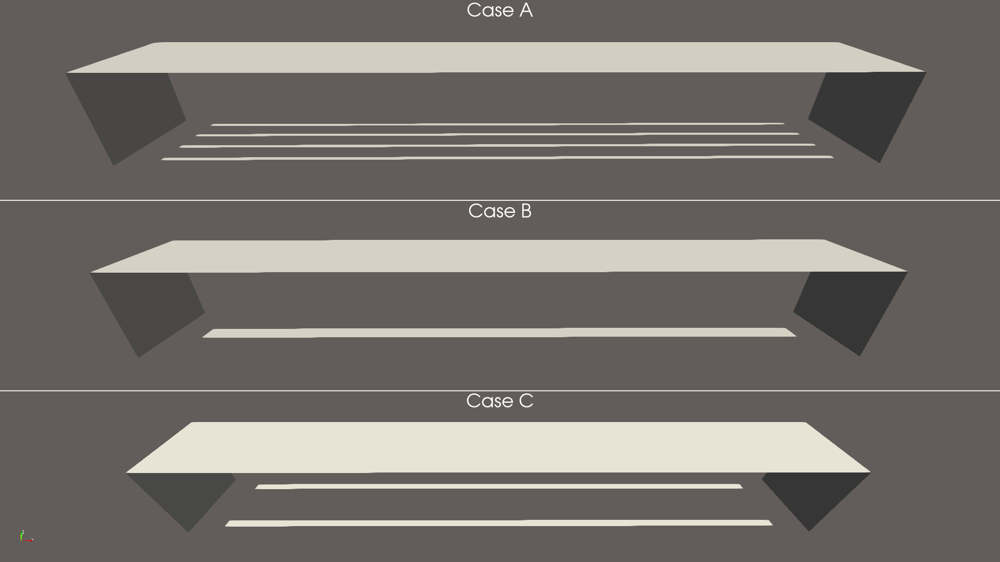

---

## Cases

Three diffuser layouts were studied:

- **Case A – Distributed Diffuser Rows**
- **Case B – Central Diffuser Rows**
- **Case C – Lateral Diffuser Rows**

The aim was to compare how diffuser placement changes gas distribution, circulation, oxygen-transfer behaviour, DO uniformity, and biodegradable substrate removal.

---

## Model setup

The aeration tank has approximate dimensions of:

- Length: **40 m**
- Width: **5 m**
- Water depth: **5.13 m**
- Tank volume: **1026 m³**

The mesh contains approximately:

- **471,040 hexahedral cells**

The same tank geometry and operating basis were used for all three layouts.

### Hydraulic conditions

- Water flow rate: approximately **79.25 m³/h**
- Hydraulic retention time: approximately **12.95 h**
- Wastewater temperature: **12 °C**
- OpenFOAM version: **v2412**

The multiphase stage was solved using an Euler–Euler air–water model.

---

## CFD workflow

The project was completed in two main stages.

### 1. Multiphase aeration simulation

The first stage resolved:

- air distribution
- water circulation
- bubble-driven mixing
- turbulence
- dissolved oxygen
- oxygen saturation
- oxygen transfer

The multiphase solution was allowed to develop before the main fields were time averaged.

Important averaged fields include:

- `U.waterMean`
- `alpha.airMean`
- `alpha.waterMean`
- `alphaUwaterMean`
- `nut.waterMean`
- `DOMean`
- `DOsatLocalMean`
- `oxygenTransferCoeffPostMean`

The reduced biological model then uses these established mean hydrodynamic fields instead of rerunning the full multiphase CFD.

### Aeration flow development

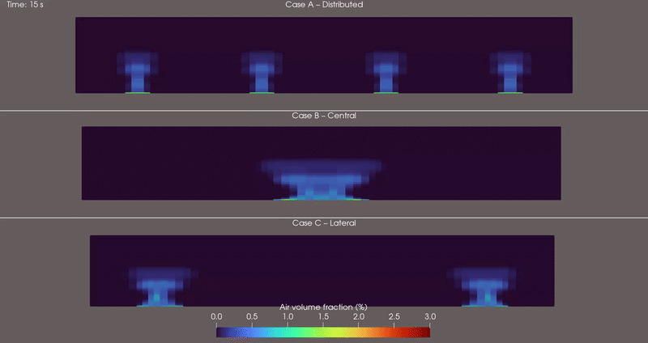
---

## Reduced ASM1 biological model

A custom OpenFOAM solver named:

```text
aerationASM1ReducedFoam
```

was developed for the biological stage.

The model is based on the aerobic carbon-removal part of ASM1.

The main state variables are:

| Field | Description |
|---|---|
| `SI` | Soluble inert organic matter |
| `SS` | Readily biodegradable substrate |
| `XI` | Particulate inert organic matter |
| `XS` | Slowly biodegradable substrate |
| `XBH` | Heterotrophic biomass |
| `XP` | Particulate products |
| `SO` | Dissolved oxygen |

The model includes:

- aerobic heterotrophic growth
- aerobic hydrolysis
- dissolved oxygen transport
- oxygen consumption
- bubble-mediated oxygen transfer
- turbulent and molecular scalar transport

The heterotrophic biomass concentration is prescribed because the CFD domain does not contain a secondary clarifier, return activated sludge loop, or waste activated sludge system.

The model therefore represents aerobic carbon removal inside the aeration tank rather than a complete activated-sludge plant.

---

## Biodegradable substrate COD

The main biological substrate field is:

```text
substrateCOD = SS + XS
```

This represents biodegradable substrate COD.

It should not be interpreted as total plant effluent COD because inert COD fractions and biomass are treated separately.

The model also calculates:

```text
solubleCOD = SI + SS
```

and:

```text
mixedLiquorCOD = SI + SS + XI + XS + XBH + XP
```

---

## Conservative biological flow field

The biological scalar equations use the time-averaged multiphase water flux.

A conservative flux projection was added before solving the biological transport equations.

The procedure:

1. creates the raw flux from `alphaUwaterMean`
2. removes flux through the atmosphere, side walls, floor, and diffuser patches
3. preserves the inlet flow
4. balances the outlet flow
5. solves a Poisson correction
6. constructs the final conservative biological flux

This prevents artificial scalar accumulation caused by divergence errors in the averaged multiphase velocity field.

---

## Oxygen transfer treatment

The biological solver uses the averaged oxygen-transfer coefficient from the multiphase simulation.

The local oxygen-transfer source is calculated as:

```text
oxygenTransferRate =
oxygenTransferCoeffBio * (DOsatLocalMean - SO)
```

Positive values represent oxygen transfer from the gas phase into the liquid.

Negative values represent local stripping where dissolved oxygen becomes greater than the local saturation concentration.

Cells directly adjacent to the atmosphere patch are excluded from the bubble-transfer field so that the free surface is not treated as a bubble plume.

Direct free-surface reaeration is not included.

---

# Results

## Mean air volume fraction

Field:

```text
alpha.airMean
```

A representative horizontal slice was taken at:

```text
z = 2.565 m
```

The same colour scale was used for all three cases.

Case A spreads the gas phase across a much larger part of the tank.  
Case B concentrates the gas along a central circulation path.  
Case C keeps most of the gas close to the lateral diffuser regions.

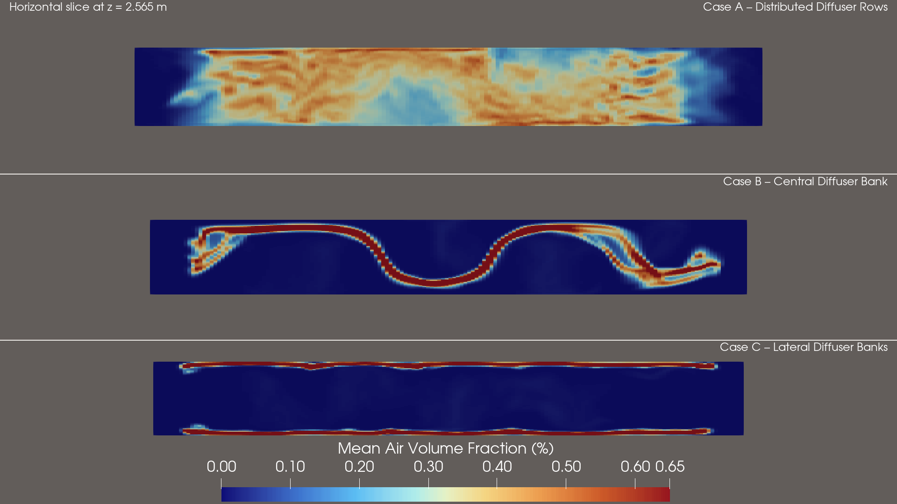


---

## Mean water velocity

Field:

```text
mag(U.waterMean)
```

Maximum mean water velocity:

| Case | Maximum velocity |
|---|---:|
| Case A – Distributed | **0.514 m/s** |
| Case B – Central | **0.727 m/s** |
| Case C – Lateral | **0.823 m/s** |

Case C produces the highest local velocity.

Case A produces a more distributed circulation field.

The results show that maximum velocity alone is not enough to judge mixing quality.

### Case A – Distributed Diffuser Rows

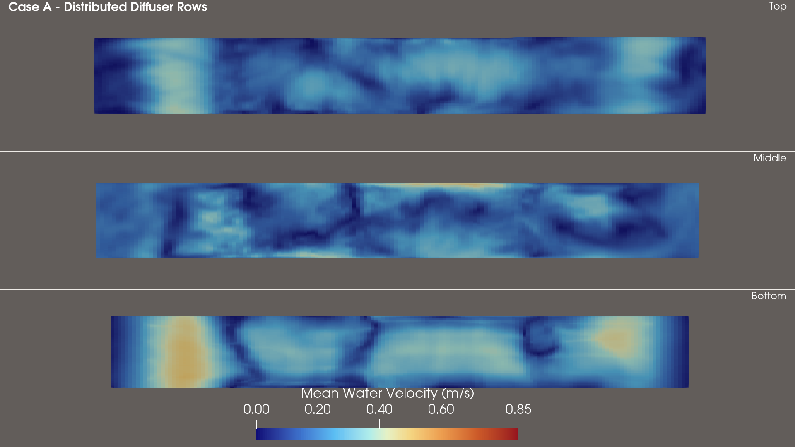

### Case B – Central Diffuser Rows

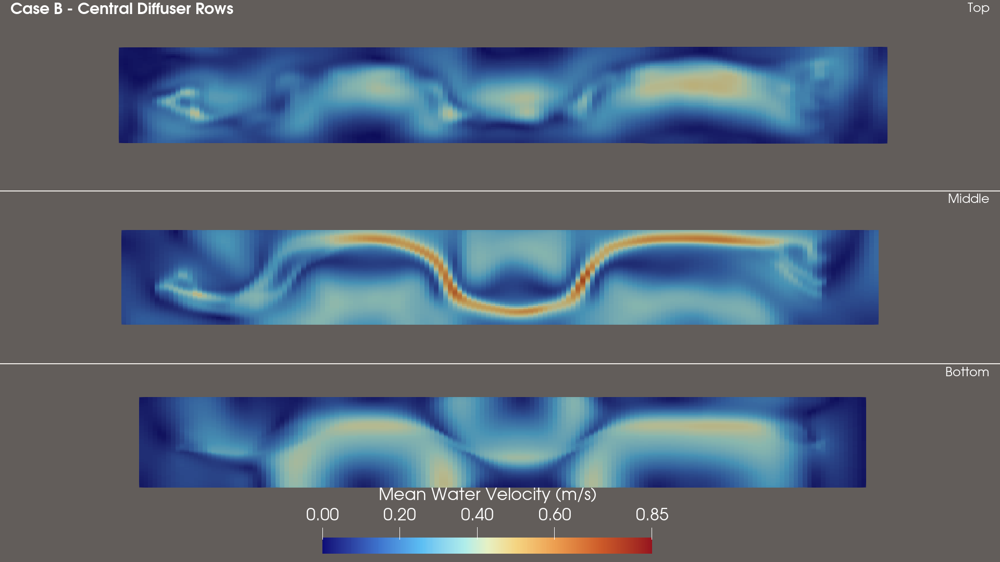

### Case C – Lateral Diffuser Rows

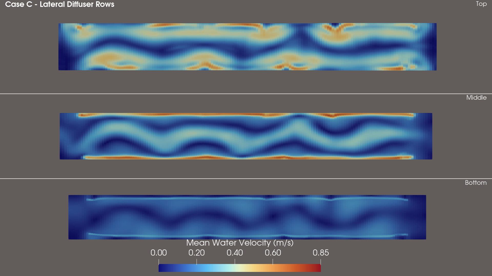

---

## Oxygen transfer coefficient

Field:

```text
oxygenTransferCoeffBio
```

Maximum corrected oxygen-transfer coefficient:

| Case | Maximum `kLa` |
|---|---:|
| Case A – Distributed | **0.0203 s⁻¹** |
| Case B – Central | **0.0261 s⁻¹** |
| Case C – Lateral | **0.0225 s⁻¹** |

Case B reaches the highest local oxygen-transfer coefficient, but the high-transfer region is concentrated.

Case A distributes oxygen-transfer capacity through a larger part of the tank.

### Case A – Distributed Diffuser Rows

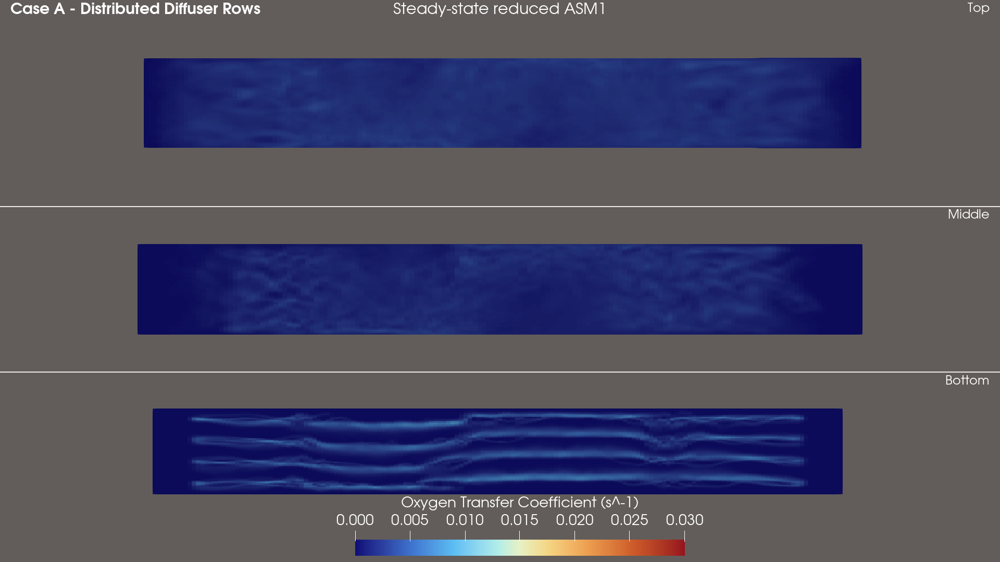

### Case B – Central Diffuser Rows

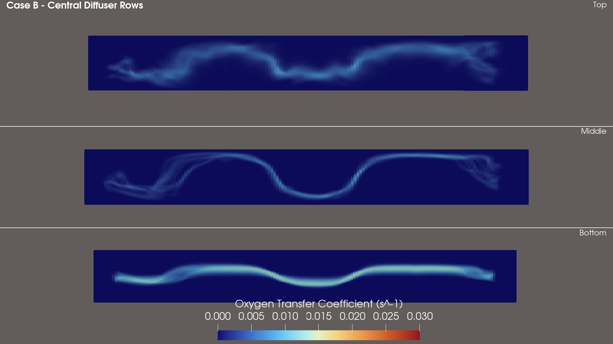

### Case C – Lateral Diffuser Rows

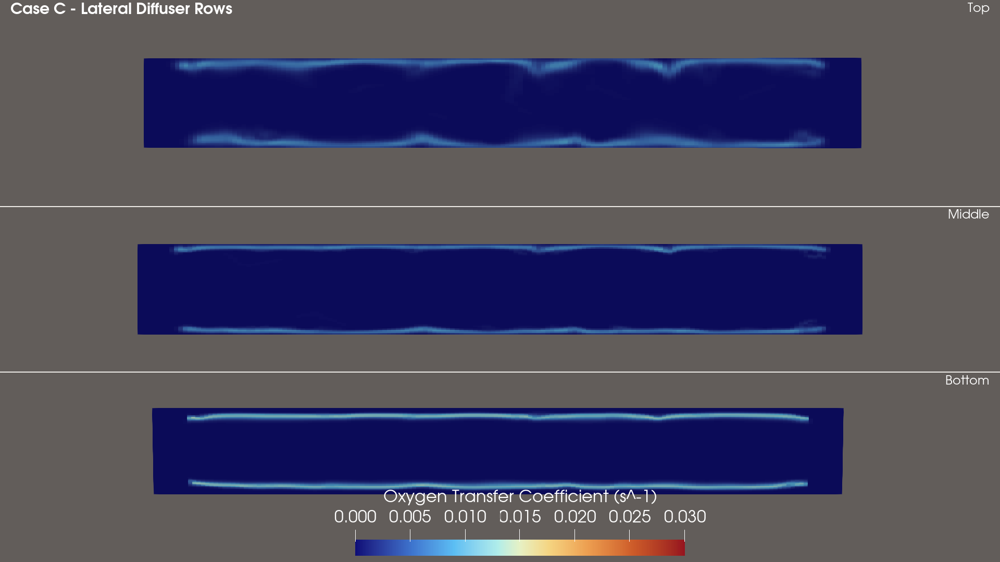

---

## Net oxygen transfer rate

Field:

```text
oxygenTransferRate
```

Integrated oxygen-transfer rates:

| Case | Oxygen transfer |
|---|---:|
| Case A – Distributed | **0.002410 kg/s** |
| Case B – Central | **0.002383 kg/s** |
| Case C – Lateral | **0.002384 kg/s** |

The total transfer rates are similar, but the spatial distribution is different between the layouts.

### Case A – Distributed Diffuser Rows

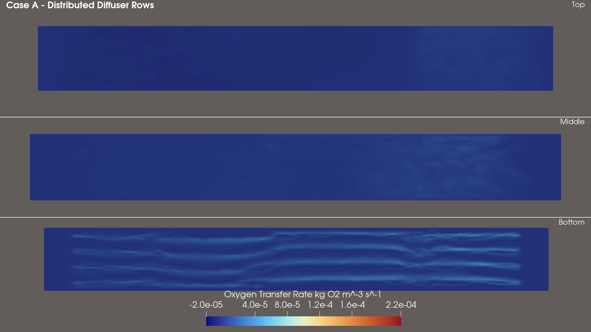

### Case B – Central Diffuser Rows

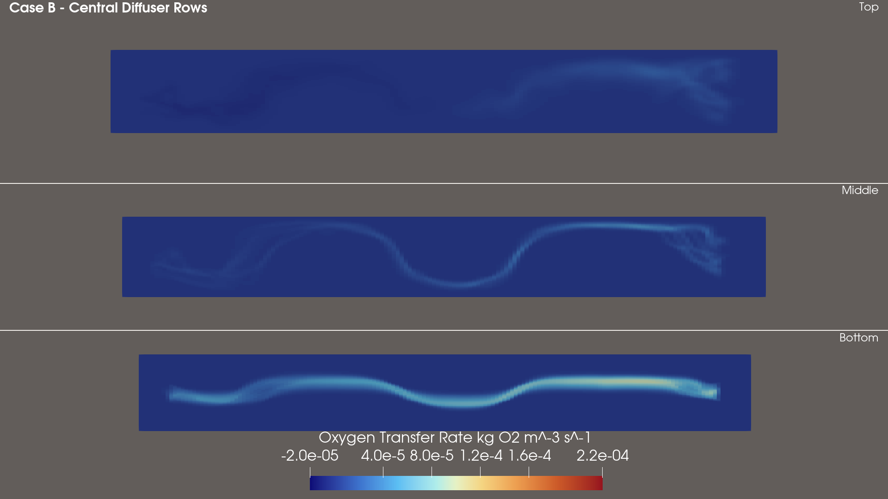

### Case C – Lateral Diffuser Rows

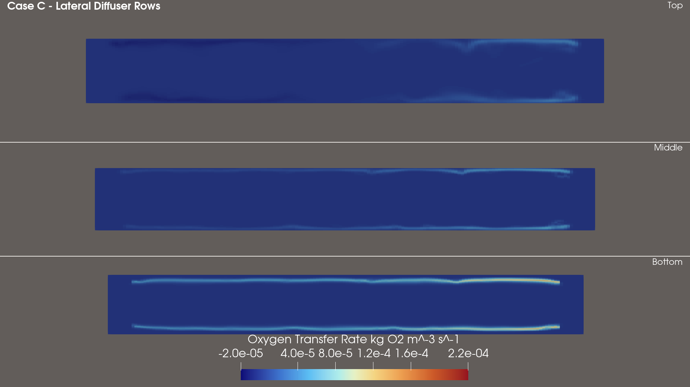

---

## Dissolved oxygen

Field:

```text
SO
```

### Volume-weighted mean DO

| Case | Mean DO |
|---|---:|
| Case A – Distributed | **10.91 mg/L** |
| Case B – Central | **9.84 mg/L** |
| Case C – Lateral | **9.56 mg/L** |

### DO uniformity

| Case | DO coefficient of variation |
|---|---:|
| Case A – Distributed | **11.4%** |
| Case B – Central | **16.2%** |
| Case C – Lateral | **24.7%** |

Case A produces the most uniform DO field.

Case C produces the largest spatial variation.

### Liquid volume below 4 mg/L DO

| Case | Volume fraction |
|---|---:|
| Case A – Distributed | **0%** |
| Case B – Central | **0%** |
| Case C – Lateral | **0.77%** |

The low-DO region in Case C is localised rather than tank-wide.

### Flow-weighted outlet DO

| Case | Outlet DO |
|---|---:|
| Case A – Distributed | **11.89 mg/L** |
| Case B – Central | **11.36 mg/L** |
| Case C – Lateral | **11.66 mg/L** |

### Case A – Distributed Diffuser Rows

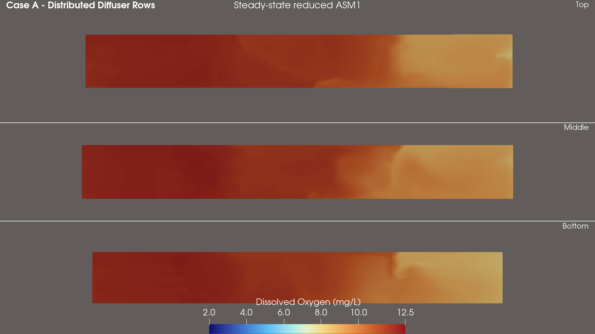

### Case B – Central Diffuser Rows

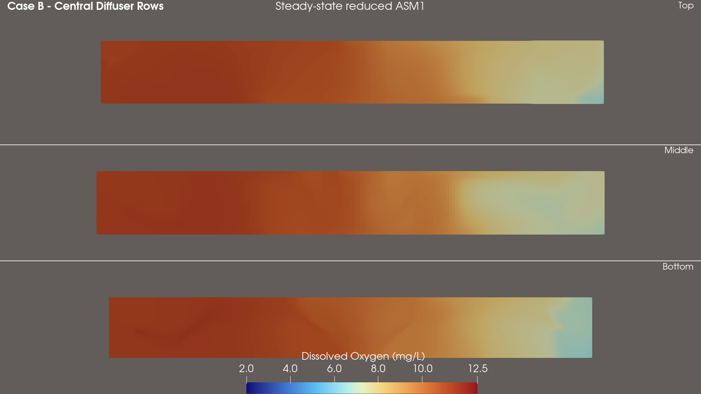

### Case C – Lateral Diffuser Rows

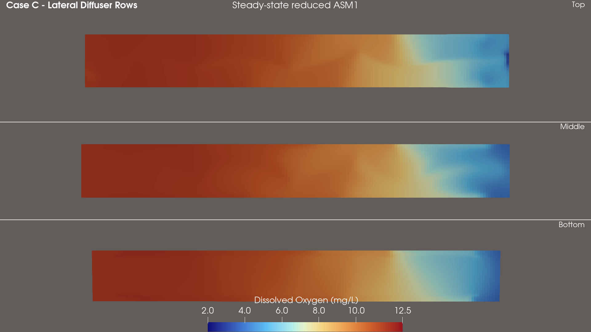

---

## Biodegradable substrate COD

Field:

```text
substrateCOD
```

### Volume-weighted mean

| Case | Mean substrate COD |
|---|---:|
| Case A – Distributed | **17.24 mg/L** |
| Case B – Central | **17.02 mg/L** |
| Case C – Lateral | **17.44 mg/L** |

### Substrate uniformity

| Case | Coefficient of variation |
|---|---:|
| Case A – Distributed | **64.9%** |
| Case B – Central | **57.0%** |
| Case C – Lateral | **75.6%** |

Case B produces the most uniform bulk substrate field.

Case C produces the greatest spatial variation.

### Liquid volume above 20 mg/L substrate COD

| Case | Volume fraction |
|---|---:|
| Case A – Distributed | **37.13%** |
| Case B – Central | **31.92%** |
| Case C – Lateral | **34.11%** |

### Flow-weighted outlet biodegradable substrate COD

| Case | Outlet substrate COD |
|---|---:|
| Case A – Distributed | **5.12 mg/L** |
| Case B – Central | **6.99 mg/L** |
| Case C – Lateral | **4.54 mg/L** |

### Calculated biodegradable substrate removal

| Case | Removal |
|---|---:|
| Case A – Distributed | **98.12%** |
| Case B – Central | **97.43%** |
| Case C – Lateral | **98.33%** |

Case C gives the lowest outlet biodegradable substrate concentration.

Case A remains close to Case C while maintaining a more uniform dissolved oxygen field.

### Case A – Distributed Diffuser Rows

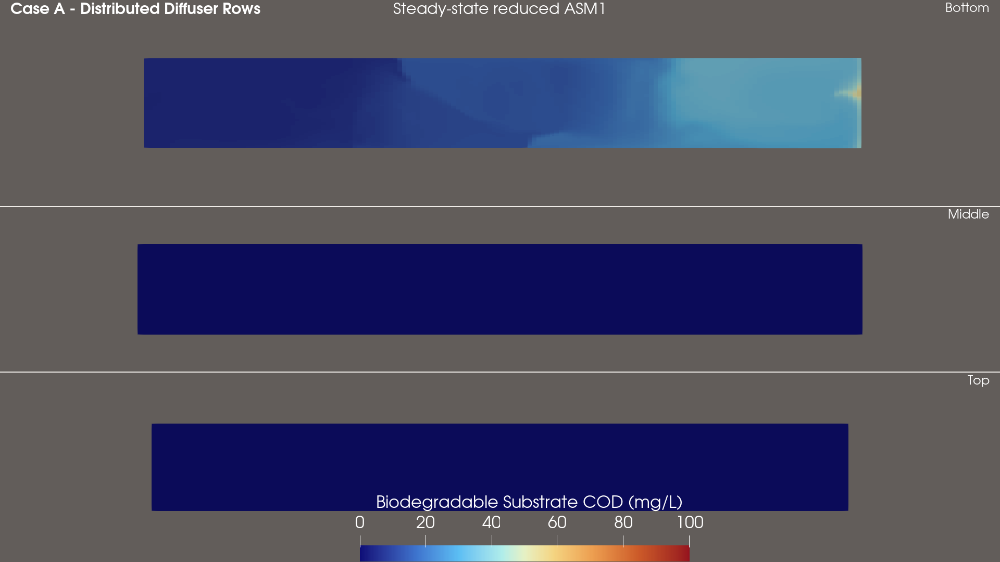

### Case B – Central Diffuser Rows

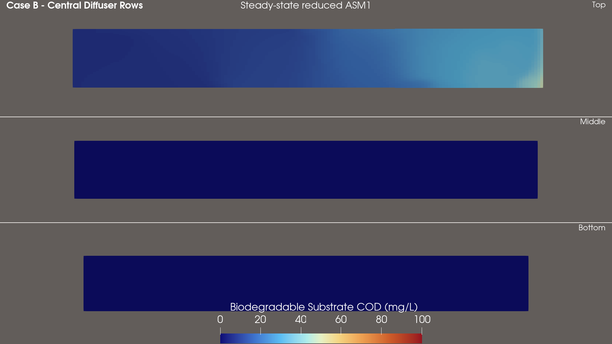

### Case C – Lateral Diffuser Rows

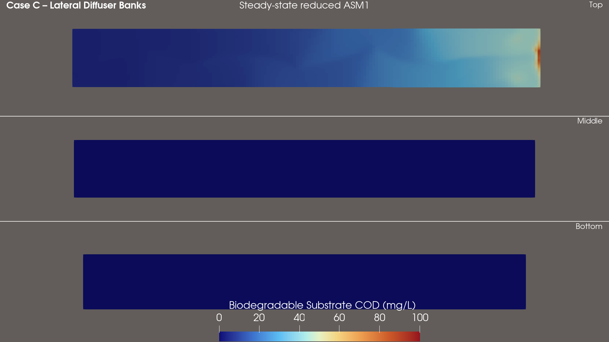

---

## Comparison of the three layouts

### Case A – Distributed Diffuser Rows

Case A gives the strongest overall balance between aeration, oxygen distribution, and biological treatment.

It produces:

- the highest mean dissolved oxygen
- the most uniform dissolved oxygen field
- no liquid volume below 4 mg/L DO
- the highest integrated oxygen-transfer rate
- broad gas distribution
- distributed water circulation
- strong biodegradable substrate removal

### Case B – Central Diffuser Rows

Case B produces a more concentrated circulation and gas-distribution pattern.

It gives:

- the highest local oxygen-transfer coefficient
- good bulk substrate uniformity
- the lowest fraction of tank volume above 20 mg/L substrate COD
- lower mean DO than Case A
- the highest outlet biodegradable substrate concentration

### Case C – Lateral Diffuser Rows

Case C produces strong circulation close to the lateral diffuser regions.

It gives:

- the highest local mean water velocity
- the lowest outlet biodegradable substrate COD
- the highest calculated biodegradable substrate removal
- the lowest mean dissolved oxygen
- the greatest DO variation
- the greatest substrate variation
- a small localised region below 4 mg/L DO

---

## Main finding

The simulations show that diffuser layout changes more than the maximum velocity or maximum oxygen-transfer coefficient.

The diffuser arrangement changes:

- where the gas phase travels
- how the water circulates
- where oxygen transfer occurs
- how uniform the dissolved oxygen field becomes
- where biodegradable substrate remains in the tank

Case A provides the most balanced overall performance because the distributed diffuser layout produces broad gas coverage and the most uniform dissolved oxygen field while maintaining strong substrate removal.

Case B performs well in bulk substrate uniformity but concentrates the main aeration and circulation path.

Case C gives the best outlet substrate result but produces the largest spatial variation inside the tank.

---

## Numerical checks

The project includes:

- mesh-quality checks
- solver convergence checks
- time averaging of multiphase fields
- conservative biological flux correction
- common colour scales across cases
- oxygen-transfer balance checks
- oxygen-consumption checks
- volume-weighted performance metrics
- outlet flux-weighted concentrations
- DO uniformity calculations
- substrate uniformity calculations

The results are treated as numerically verified CFD results.

---

## Repository structure

```text
.
├── README.md
├── solver/
│   └── aerationASM1ReducedFoam/
│
├── cases/
│   ├── CaseA_Distributed/
│   ├── CaseB_Central/
│   └── CaseC_Lateral/
│
├── postProcessing/
│   ├── dictionaries/
│   └── scripts/
│
├── figures/
│   ├── overview/
│   ├── hydrodynamics/
│   ├── oxygen_transfer/
│   └── biological_response/
│
├── media/
│   └── animations/
│
└── docs/
```

The repository contains the case setup, custom reduced ASM1 solver, post-processing tools, comparison results, and final visualisations.

Large transient simulation outputs and processor directories are not intended to be stored directly in Git.

---

## Software

- OpenFOAM v2412
- ParaView
- Custom OpenFOAM solver: `aerationASM1ReducedFoam`

---

## Current scope

The biological model focuses on aerobic carbon removal inside the aeration tank.

The current model does not include:

- nitrification
- denitrification
- secondary clarification
- return activated sludge
- waste activated sludge
- dynamic solids retention time
- full plant-wide ASM1 dynamics

The project is therefore a coupled aeration CFD and reduced biological-treatment model rather than a complete wastewater-treatment-plant simulation.
